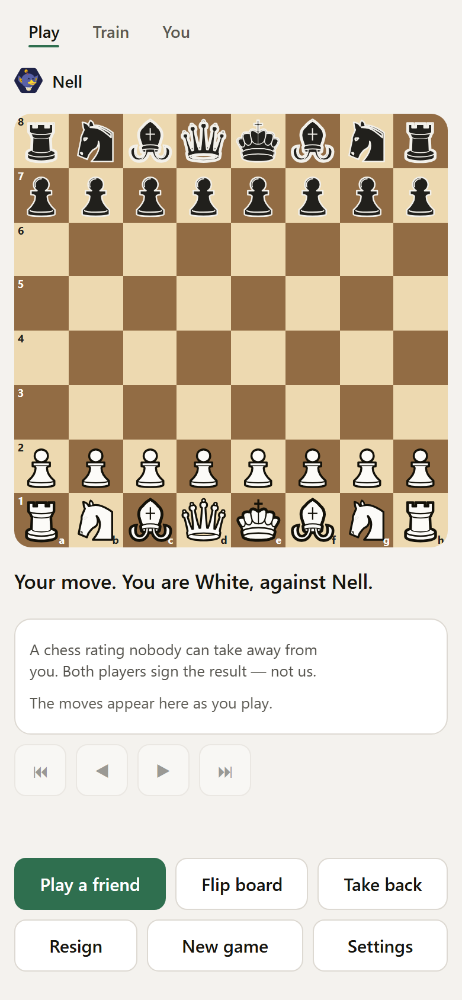
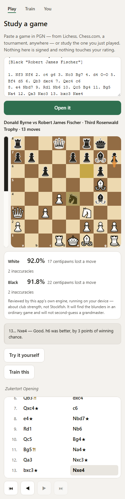
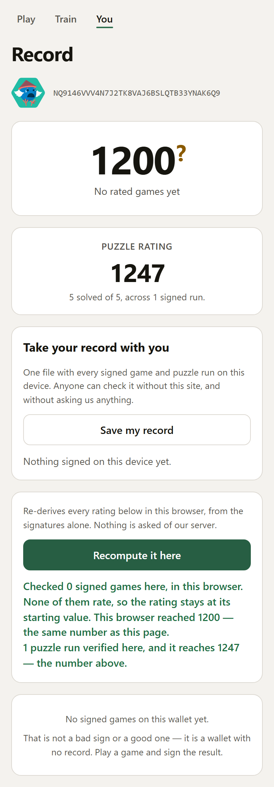
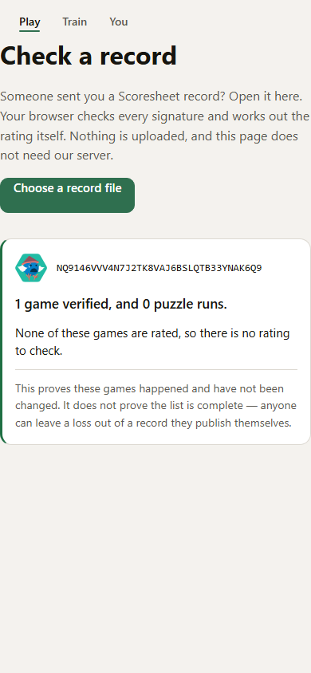
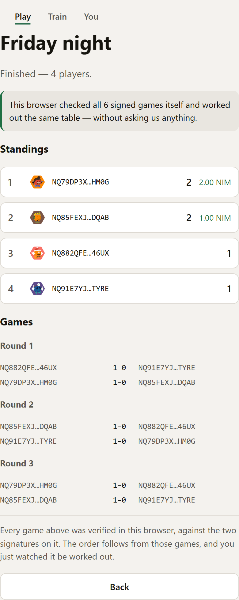

# Scoresheet

[](LICENSE)
[](#checking-it-yourself)
[](#checking-it-yourself)
[](https://nimiq.com/nimiq-pay)

**A chess rating nobody can take away from you.**

Play a game. Both players sign the result with their Nimiq wallet. The rating that comes out is
derived from those two signatures — so it is not issued by us, cannot be revoked by us, and can be
recomputed from scratch by a stranger in their own browser with our server switched off.

That last sentence is the entire product, and the app is built so you can check it rather than
believe it. Every record page has a **Recompute** button: it re-derives the whole rating chain
locally, verifying every signature, and prints the number it reached beside the number we showed. If
they ever disagree, ours is wrong, and the page says so.

---

## What it looks like

| | |
|---|---|
|  |  |
| **The board.** Ours, not a library: drag and tap-tap, premoves, promotion in place, playable end to end from a keyboard with every square announced. | **Game review.** Every move judged, an accuracy for each side, and one plain sentence saying *why* a move was bad — then the position handed back so you can find the better move yourself. |
|  |  |
| **The record.** Every game in canonical order, and a **Recompute** button that re-derives the rating from the signatures in your own browser. If it ever disagreed with us, the page would say so. | **`/verify`.** Drop in a record file and every signature is checked, both Merkle roots recomputed and the rating re-derived — with no request to our server at all. |



**Tournaments.** Round-robin to eight, Swiss above it, no drawing of lots anywhere. A result is not a
score somebody reports — it is the signed game itself, and this page verifies every one of them in
the reader's browser before it builds the table.

---

## Try it in sixty seconds

```bash
npm install
npm run dev          # the app, on http://localhost:5174
npm run server       # the API — the live-game link and rated puzzle runs
```

Then open `http://localhost:5174/?demo=1` and do these four things. They are the whole product, in
order, and nothing in between is needed.

| | Do this | What it proves |
|---|---|---|
| **0:00** | Play a move | A real game against a real engine. No wallet, no account, no sign-up, no server. The sentence under the board says what the app is; it goes away once you have proved it. |
| **0:15** | Press **Resign** twice — it confirms — then **Sign the result so it counts** | The scoresheet: the exact bytes both players sign, shown in full *before* you sign them. |
| **0:35** | Follow **See your record**, press **Recompute it here** | This browser re-derives the rating from the signatures alone, verifying every one, with our server switched off. If it ever disagreed with us the page would say so. |
| **0:50** | Open **Train** and solve five puzzles | A **rating you earn alone**. The server chooses the puzzles and countersigns the result, so it is a witness rather than an authority — and `Recompute` checks those signatures too. Having signed at 0:15 your runs are already rated; from a fresh browser the screen offers **Make my runs count** instead of asking for a wallet. |

That last row is the one worth pausing on. Everything else here needs a second person with a Nimiq
wallet; that one needs neither, which is the difference between a product a judge can evaluate on
their own and a product they have to take on trust.

On a desktop there is no Nimiq Pay, so add `?demo=1` for a stand-in wallet. It signs with a **real**
Ed25519 key whose seed is published in `apps/web/src/demo-wallet.ts` — the signatures genuinely
verify, and every screen says plainly that the key is public, so it proves the mechanism rather than
an identity.

---

## What is built

| | |
|---|---|
| **The board** | Ours. 64 elements, drag *and* tap-tap, premoves, promotion in place, zen mode, blindfold, arrows and square marks, three board colourways, coordinates, move dots, sound and haptics that are synthesised rather than sampled. Playable end to end from a keyboard — arrows to move around the board, Enter to lift and place, `Home`/`End` to the edge of a rank — with every square announced. |
| **The engine** | Ours, MIT, on its own 0x88 board: alpha-beta with iterative deepening, a transposition table on Zobrist keys, killer and history ordering, null-move pruning, late move reductions and a quiescence search with delta pruning. **Millions of nodes a second** — `npm run counts` prints the rate *your* machine reaches and fails below half a million, because the `chess.js` search it replaced managed about six thousand. No fixed figure is quoted here on purpose: a rate is hardware-dependent, and a number in a README that drifts between runs is the kind of claim this file exists not to make. Perft-verified to depth five on six standard positions, and agreeing with `chess.js` move for move over thousands of random ones. |
| **The bot** | Four opponents with names and no ratings, each with a face, a clock if you want one, and a deliberate blunder rate so they are weak in human-looking ways. A 2,833-line opening book gives them variety and gives the position a name. |
| **Game review** | Every move judged, an accuracy for each side, average centipawn loss, and the engine's move drawn as an arrow — in a worker, so the board never freezes. Built on Lichess's published accuracy method, and it says on its face that it is club strength rather than Stockfish. **That claim is measured, not asserted:** `node scripts/strength.mjs` runs the engine over the bundled Lichess puzzles, which carry real ratings — it finds the key move in 91% and holds the whole line in 86%. The script states its own sampling bias and refuses to print a playing rating from it. |
| **Why the move was bad** | Under the verdict, one plain sentence: the piece this move left to be taken, the pin it walked into, the passed pawn it conceded, the mate it missed. Detected from the position itself and templated — **no language model is anywhere in the truth-bearing path**, because a review that says something false once is never trusted again. `npm run explain` checks every claim against 12,000 real positions independently: **no false statement, and 44% of real mistakes explained.** The other 56% get the number and silence, which is the design. A fork detector was built, measured at five false claims out of five, and deleted. |
| **Puzzles** | 5,000 from the Lichess database, bundled and offline: a daily, endless training that finds your level, Storm, Streak, and twelve ideas you can train one at a time. |
| **A rating you can earn alone** | A run of five puzzles, **served by the server and signed by both of you** — a puzzle rating that needs one wallet and no second person. The server picks the puzzles and countersigns what came back, so it is a witness rather than an authority: it cannot revoke the rating, cannot edit it, and a stranger checks both signatures in their own browser. Bot games stay unrated for ever, which is the same call Lichess makes and for the same reason. |
| **The coordinate trainer** | Find the square and name the square, thirty seconds, with the average kept separately for each orientation — because reading a board from behind the black pieces is a different skill. |
| **The scoresheet** | Twelve lines of canonical text, signed by both players, verifiable with two small libraries instead of a 50 MB WASM bundle. |
| **The record** | Every game in canonical order, the rating before and after each, and the Recompute button. Nothing on it is writable by its subject. |
| **A public certificate** | `/c/<gameId>` — a finished game as a page a stranger can open with no wallet, no account and no app. It rebuilds the signed text and verifies both signatures in *their* browser, then says so. |
| **Bots that are actually in order** | Pip, Nell, Vera and Oskar are offered as increasing difficulty, and until now that was an assumption: they differ on depth, thinking time **and** how often they deliberately play a worse move, so "deeper is stronger" needed checking. `npm run levels` plays each adjacent pair head to head, colours alternating, book off, and reports the score with a confidence interval. **Every pair came out ordered with the whole interval above an even score** — Nell 100% over Pip, Vera 90% over Nell, Oskar 95% over Vera, ten games each. Absolute Elo is **not** claimed: that needs a reference engine, and none is installed here. |
| **Your whole record, as a file** | The certificate proves one game; this is the rest. One JSON file with every signed game and puzzle run, in canonical order, under two Merkle roots built to RFC 9162. Hand it to anyone: `/verify` checks every signature, recomputes both roots and derives the rating in **their** browser. The browser test drives that path with every request to our server aborted, so "you do not need us" is measured rather than claimed. It says plainly what it does not prove — signatures cannot show that a list is *complete*, because nobody can prove an absence. |
| **Live games** | A share link, server-authoritative play over HTTP polling, clocks the server owns, and a win on time that is *claimed* rather than taken. |
| **Tournaments** | Hold one from the play screen and send the link. Round-robin to eight, Swiss above it, colours balanced by debt, tie-breaks by Sonneborn-Berger and then by the games between the tied players — and **no drawing of lots anywhere**, which FIDE's own handbook falls back on twice. The draw is a hash of the closed entrant list, so it is reproducible by anyone. **A result is not a score somebody reports; it is the signed game itself**, and `/t/<id>` verifies every one of them in the reader's browser and derives the table from the signatures. A game whose signature does not check is dropped, and the page says how many. Attacked rather than assumed: an unsigned score, a game one side did not sign, a game against somebody you were not paired with, a game played before the tournament existed, and one played on another network are each refused with their own answer. |
| **Sharing** | A finished game as a picture carrying both signatures in full and both players' Nimiq identicons, and as PGN that every chess program on earth reads. Games come *in* as PGN too, from Lichess, Chess.com or a tournament. |
| **Five languages** | English, Spanish, German, French and Portuguese — the five Nimiq Pay supports, following the host unless you choose otherwise. Each dictionary is its own chunk, so nobody downloads four languages they cannot read. Every screen is translated, including the rated-run ones, which were English-only until a cold read of the *first* screen found the front-door sentence itself hardcoded and the sweep that followed found eight more. |
| **The pool** | Solve the daily puzzle, get NIM. The payout carries the puzzle's id in its memo, so the pool's whole history is auditable with a block explorer and nothing else. |

## Four Nimiq integrations, all load-bearing

1. **`sign()` is the rating.** Not a login — the signature *is* the record, and the whole product
   rests on two of them over the same bytes.
2. **Payments go both ways.** The pool pays real NIM to real wallets with the reason inside the
   transaction (`packages/server/src/pool.ts`) — and a *player* sends their own, from their own
   wallet through the provider: a tip to the opponent after a game, or a contribution back into the
   pool (`apps/web/src/send-nim.ts`). Neither is custodial, and neither is a wager.
4. **Staking funds the payments.** The pool is delegated to a validator and payouts come from the
   rewards, never the principal — which is arithmetic in `packages/server/src/staking.ts`, not a
   promise.

   Said precisely, because the loose version of this claim is tempting: Nimiq documents seven
   staking methods on the *provider*, for a player's own wallet, and this app does not call them —
   nobody plays chess in order to stake. What it does instead is build the same protocol
   transactions with `@nimiq/core` from the pool's own operator wallet. So the honest claim is that
   staking is load-bearing *economics* here rather than a button, and that no shipped Mini App in
   the catalog exercises Nimiq staking in either form.

3. **The host's own language and device.** `window.nimiqPay.language` chooses the app's language on
   launch, and `requestDeviceIdentifier` is what keeps the pool fair without asking anybody to log
   in. Both are checked against `@nimiq/mini-app-sdk`'s own types rather than a summary of them —
   which is how we found we were calling the second one with the wrong argument shape, and that it
   would have failed on a real phone.

---

## Checking it yourself

The claim is that you do not have to trust us. Three ways to hold us to it:

```bash
npm run check     # everything below, in order
npm run counts    # 723 unit tests, and the link-preview card is really 1200×630
npm run licences  # every dependency declared, allowed, and credited in NOTICES.md
npm run provider  # every Nimiq call we make is one the SDK actually declares
npm run design    # 156 contrast pairs measured, and every CSS token resolved
npm run look      # 581 checks in two real browsers, including a two-player game
npm run judge     # opens it cold on a throttled phone, the way a stranger would
npm run demo      # records the demo film by driving the built app, ~70 seconds
```

**Every number in that block is checked by the command beside it.** They are not typed in and hoped
over: `counts` runs the suite and fails if this file claims the wrong total, `design` does the same
for the contrast pairs, and `look` for the browser checks. The first version of this table said 42
contrast pairs when there were 138, which is exactly the kind of thing a document arguing "check it
rather than believe it" cannot afford.

`npm run look` builds the app, starts the API, opens two isolated browser contexts, plays a real
game between them over the real server, signs it, and reads back what reached the chain. Screenshots
of every screen land in `shots/`.

`npm run judge` is the opposite kind of test: a cold profile, no stored data, a phone-sized screen
and the network throttled to mobile data, opening the app the way somebody who has never seen it
would. It settles the mechanical half — does a board appear, does a piece move, does the record page
still check out with our server unreachable, does it work in airplane mode — and then prints **nine
questions it deliberately refuses to answer**, because they are about whether a person *understood*
anything, and no script can tell you that. Those stay PENDING until real people run them. That is
the honest state of this entry's comprehension testing, and it is written down rather than implied.

The one thing worth reading if you read nothing else is
`apps/web/src/verify-browser.ts` — the independent verifier, checked against `@nimiq/core`'s own
output over two hundred random keys, because a verifier that disagreed with the wallet by one byte
would attribute every signature to the wrong person and nothing would look wrong while it happened.

---

## Running it for real

```bash
# The app
npm run build                       # apps/web/dist, served as static files

# The API (live games). Anything serving the app forwards /api to it.
PORT=8787 GAMES_DIR=.games npm run server
```

| Variable | What it does |
|---|---|
| `NIMIQ_RPC` | A Nimiq node. Defaults to the public one. |
| `GAMES_DIR` | Where live games are kept. Empty means memory only. |
| `POOL_PRIVATE_KEY` | Turns the puzzle pool on. **Without it the pool reports itself unfunded and every screen says so** — the whole path exists either way. |
| `POOL_REWARD_NIM` | What one solved daily puzzle pays. |
| `POOL_DAILY_NIM` | The day's ceiling. `stake-cli report` prints the right value. |
| `WITNESS_PRIVATE_KEY` | Turns rated puzzle runs on. **Secret, unlike the bot's published key** — a published witness key would let any solver witness their own run. Without it puzzles work exactly as before and the screen says runs are not rated. |

```bash
# Stake the pool, once, by hand — never automatically.
POOL_PRIVATE_KEY=… node --experimental-strip-types packages/server/src/stake-cli.ts delegate <validator> 1000
POOL_PRIVATE_KEY=… POOL_PRINCIPAL_NIM=1000 node --experimental-strip-types packages/server/src/stake-cli.ts report
```

### What is not done

Said plainly, because a list of everything that works and nothing that does not is not a status
report:

- **The pool has no NIM in it.** Everything above the wallet is built and tested — the limits, the
  ceiling, the transaction, the memo, the staking — and a stand-in node in the test suite verifies
  every signature exactly as a real one would. What is missing is a funded wallet, which is the one
  thing code cannot supply.
- **A Stockfish-class network was built, measured, and rejected.** This is the longest entry here
  because it is the one that cost the most and the one whose answer was "no".

  `packages/core/src/nnue.ts` is a complete port of **akimbo v1.0.0's evaluation network** — MIT,
  self-generated training data, ~3500 CCRL Blitz in its own engine — chosen because Stockfish is
  GPL-3 and this repository is MIT, and because akimbo's net is 6.3 MB where Caissa's is ~50 MB and
  Arasan's 25 MB. The port is exact: `node scripts/nnue-agrees.mjs <akimbo>` runs 25 positions
  through the real akimbo binary and this code and requires them to agree **to the centipawn**, which
  they do. A diffing accumulator cache (akimbo's own design, ported) took it from 77 µs to 14.5 µs
  per evaluation, against the hand-written evaluation's 0.98 µs.

  Then it was measured, three ways, and only the third asked the right question:

  | Measurement | Hand-written | Network |
  |---|---|---|
  | Lichess puzzles, 300 ms, 360 puzzles | 91% first / 87% whole line | 91% / 88% |
  | Lichess puzzles, 1000 ms, 240 puzzles | 95% / 93% | 95% / 93% |
  | Self-play against it, 100 ms a move, 120 games | — | **64.6%, +104 Elo, 95% interval 41–176** |
  | **Reviewing Byrne–Fischer 1956, 300 ms** | flags 11.Bg5 and 15.Bc4 | **calls 17...Rfe8+ a blunder** |

  The network is genuinely the stronger *player*, and not marginally: 120 games with colours
  alternating and openings fixed put it **+104 Elo ahead, with the whole confidence interval above
  even**. It is nevertheless the worse *reviewer*, and Game Review was the only thing it was for. Costing 15× per evaluation means
  searching 15× fewer positions, and grading a game is precisely where that hurts: at 300 ms a
  position it condemned one of the most celebrated moves ever played, while the hand-written
  evaluation flagged only the two moves that are actually criticised. Raising the budget to 2500 ms
  does fix it, and takes a hundred seconds a game instead of twelve.

  So it does not ship. The code, its tests and both measuring scripts stay, because the measurement
  is the point and the code is its evidence — but nothing imports it, no build step downloads 6.3 MB,
  and `npm run look` asserts that reviewing a game requests no network at all. `SearchLimits.evaluate`
  is the seam it proved out, and it is the part that was worth keeping.

  Both halves of that are worth stating plainly, because they look contradictory and are not: a
  stronger player is not a better grader when the two are given the same seconds. Playing rewards
  judgement accumulated over fifty moves; grading a sacrifice rewards seeing to the end of it.

- **The engine is ours, and it is about club strength — not Stockfish.** That is enough to find the
  blunders in an ordinary game and not enough to correct a grandmaster, and the review screen says
  so where somebody reads it rather than only here. Puzzles generated from players' own blunders,
  and bots at an exact rating, are the next things it unlocks and are not built.
- **Coaching payments are specified and not built** (`SPEC.md` K5).
- **A witnessed run can be abandoned rather than signed.** A card moves a rating only once the solver
  signs it, so somebody can decline a run that went badly. The witness refuses to open a second run
  while one is outstanding, which makes retrying cost an hour rather than a tap — that is a deterrent,
  not a proof, and it is the price of a rating we cannot issue on anybody's behalf. Lichess does not
  have this problem because it *is* the authority on your rating; this deliberately is not.
- **No fiat figure anywhere.** Nimiq Pay does not expose the user's currency — checked against the
  SDK's own `NimiqPayHostContext`, which has exactly `language` and `requestDeviceIdentifier` — and
  at **$0.00034 a NIM** (7 September 2026) every amount in this app would render as `$0.00`. A price
  feed that made a real on-chain payment look like nothing would be worse than no price feed.

---

## Layout

```
apps/web            the app — framework-free TypeScript, no React
packages/core       rules, the scoresheet, Elo, the engine, the opening book
packages/verify     signature verification against @nimiq/core
packages/server     live games, the puzzle pool, staking
scripts             vendoring, the browser journey, the contrast measurements
```

`SPEC.md` is the full specification, written as it was researched. `BRIEF.md` is the short version.

## Licence and credit

MIT — see `LICENSE`. Everything borrowed is listed in `NOTICES.md` with its licence and what was
changed, and everything deliberately *not* borrowed is listed there too, with why.

The pieces are **chessnut** by Alexis Luengas (Apache-2.0). The puzzles and the opening names are
from **Lichess**, released into the public domain — CC0 requires no attribution and they get it
anyway, on the screen that uses them.
